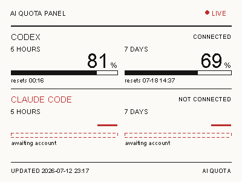
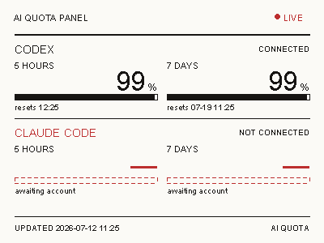

# EPD AI Quota Display

把 Codex 的真实剩余配额显示在 400×300 黑白红三色墨水屏上，并通过 macOS
每 30 分钟自动刷新。



高剩余量边界测试：



本项目面向使用
[`YCD12/EPD-nRF5_DYC`](https://github.com/YCD12/EPD-nRF5_DYC) 固件的
nRF52811 电子价签。Mac 负责读取配额、渲染页面和通过 BLE 传图；墨水屏本身
不需要 Wi-Fi。

> 当前版本已经接入 Codex。Claude Code 暂时保留相同层级的 5 小时和 7 天
> 占位，后续可以补充数据源。

## 最终效果

面板包含：

- Codex 5 小时窗口剩余百分比、进度条和重置时间；
- Codex 7 天窗口剩余百分比、进度条和重置时间；
- Claude Code 5 小时与 7 天占位；
- 最后更新时间（日期 + 时间）；
- 黑、红、白三色图层。

最终设计稿也保存在
[`design/Codex Claude Quota Display.html`](design/Codex%20Claude%20Quota%20Display.html)，
方便在浏览器中查看排版方案。实际写屏使用的是 `epd_status.py` 中对应的
Pillow 渲染实现。

屏幕的内容虽然看起来是文字和进度条，但对设备而言仍然是两个 1-bit 位图
图层。Mac 使用 Pillow 先把数据排版成 400×300 像素，再分别发送黑色层和
红色层。

## 工作原理

```text
~/.codex/auth.json
        │
        ▼
ChatGPT Codex usage endpoint
        │
        ▼
epd_status.py 计算剩余比例并绘制 400×300 页面
        │
        ├── black plane: 15,000 bytes
        └── red plane:   15,000 bytes
        │
        ▼
macOS CoreBluetooth / Bleak
        │
        ▼
nRF52811 + EPD-nRF5_DYC firmware
        │
        ▼
SSD1619 black/white/red EPD
```

配额获取方式参考
[`farion1231/cc-switch`](https://github.com/farion1231/cc-switch)：读取 Codex
在本机保存的 ChatGPT OAuth 会话，然后直接请求 Codex usage endpoint。
访问令牌只作为 HTTPS 请求头使用，不会输出到日志、图片或项目文件。

## 硬件与软件要求

### 硬件

- Apple Silicon 或 Intel Mac，支持蓝牙；
- 刷入 EPD-nRF5_DYC 固件的 nRF52811 电子价签；
- 400×300、SSD1619、黑白红三色墨水屏；
- 设备广播名称以 `NRF_EPD` 开头。

本项目已经验证过的设备配置通知为：

```text
MOSI=14 SCLK=13 CS=06 DC=05 RST=04 BUSY=03
BS=02 model=02 LED=12 EN=07
```

不同屏幕、驱动芯片或引脚配置可能需要修改原固件，而不只是修改本项目。

### 软件

- macOS；
- Python 3.10 或更高版本；
- 已登录的 Codex ChatGPT 账号；
- Python 包：`bleak`、`Pillow`。

## 一、安装

将仓库放到任意固定目录，然后进入项目：

```zsh
cd /path/to/epd-ai-quota-display
python3 -m venv .venv
.venv/bin/pip install -r requirements.txt
```

确认本机存在 Codex 登录文件：

```zsh
test -f ~/.codex/auth.json && echo "Codex login found"
```

程序不会打印其中的 token。如果 Codex 使用 API key 模式而不是 ChatGPT
登录模式，则无法通过这里的 endpoint 获取订阅配额。

## 二、先只生成预览

```zsh
.venv/bin/python epd_status.py --dry-run
```

成功后会显示类似：

```text
Fetched Codex usage windows: 5 HOURS 42% left, 7 DAYS 81% left
Rendered /path/to/test-card.png (15000 bytes x 2 layers)
```

预览文件保存在项目根目录的 `test-card.png`。这一步会访问网络，但不会连接
蓝牙，也不会改变屏幕内容。

## 三、验证屏幕和固件

如果还没有验证硬件，先调用固件内置日历：

```zsh
.venv/bin/python epd_status.py --calendar-test
```

日历能显示，说明以下链路基本正常：

- Mac 能扫描并连接设备；
- 固件的屏幕型号和引脚配置可用；
- EPD 初始化与刷新正常。

如果日历可以显示而自定义图片空白，重点查看
[排错指南](docs/TROUBLESHOOTING.md) 中的清屏后重新初始化问题。

## 四、写入真实 Codex 数据

确保设备正在广播，且没有被网页或其他 BLE 客户端占用：

```zsh
.venv/bin/python epd_status.py
```

一次完整成功的结尾应当是：

```text
Sent black 62/62 chunks
Sent red 62/62 chunks
Requesting screen refresh …
Refresh command sent. The panel may take several seconds to settle.
```

墨水屏刷新需要几秒钟。完整流程会先清除旧画面，再重新初始化 EPD，发送
黑色层和红色层，最后触发刷新。

可用参数：

| 参数 | 用途 |
| --- | --- |
| `--dry-run` | 只获取数据并生成预览，不使用蓝牙 |
| `--calendar-test` | 让固件显示内置日历，用于硬件诊断 |
| `--fixed-test` | 发送固定测试卡，不获取 Codex 配额 |
| `--no-clear` | 不先清除已有色彩层，主要用于实验 |
| `--name-prefix PREFIX` | 修改要扫描的 BLE 名称前缀 |

## 五、设置每 30 分钟自动更新

macOS 使用 `launchd` 管理后台任务。项目提供了安装脚本，会：

1. 创建或复用 `.venv`；
2. 安装依赖；
3. 根据当前项目路径生成用户级 LaunchAgent；
4. 注册任务；
5. 注册后立即运行一次，此后每 1800 秒运行一次。

执行：

```zsh
chmod +x scripts/*.sh
./scripts/install-launchagent.sh
```

不需要一直打开 Terminal。任务注册在：

```text
~/Library/LaunchAgents/com.local.epd-ai-quota-display.plist
```

查看运行状态：

```zsh
launchctl print gui/$(id -u)/com.local.epd-ai-quota-display
```

立即手动触发一次：

```zsh
./scripts/update-now.sh
```

查看日志：

```zsh
tail -n 100 logs/update.log
tail -n 100 logs/error.log
```

卸载定时任务：

```zsh
./scripts/uninstall-launchagent.sh
```

卸载脚本只注销 LaunchAgent 并删除安装到 `~/Library/LaunchAgents` 的 plist，
不会删除项目、虚拟环境或日志。

### 修改更新间隔

模板文件位于：

```text
launchd/com.example.epd-ai-quota-display.plist.template
```

默认值：

```xml
<key>StartInterval</key>
<integer>1800</integer>
```

单位为秒。例如一小时是 `3600`。修改模板后重新运行安装脚本。

30 分钟是比较平衡的默认值：Codex 配额不需要分钟级刷新，同时可以减少
墨水屏全刷次数和无意义的 BLE 连接。

## 定时运行的限制

- Mac 必须开机、用户已登录且处于唤醒状态；
- 该任务不会单独唤醒正在睡眠的 Mac；
- 墨水屏必须在蓝牙范围内并处于可广播状态；
- Codex OAuth 登录过期后，需要先重新登录 Codex；
- 如果某次网络请求或蓝牙扫描失败，日志会记录错误，屏幕会保留上一次画面；
- 当前是全屏刷新，不适合非常高频地运行。

## 为什么不是 macOS App

当前链路只有一个数据源和一块屏幕，Python + LaunchAgent 已经能够做到：

- 登录后启动；
- 无终端后台运行；
- 固定间隔更新；
- 保存日志；
- 手动触发刷新。

如果以后需要菜单栏状态、图形化设置、多设备管理或错误通知，可以再把同一
套数据和 BLE 逻辑封装为 Swift 菜单栏 App。现阶段脚本方案更透明，也更方便
排错。

## 添加 Claude Code 数据

渲染器已经为 Claude Code 预留了与 Codex 相同层级的两个窗口。后续接入时，
建议让数据获取函数输出统一结构：

```python
{
    "label": "5 HOURS",
    "used": 35.0,
    "reset_at": 1783812345,
}
```

`used` 表示已用百分比，界面会显示 `100 - used` 的剩余量。接入数据源时应
避免把账号 token 写入日志或仓库。

## 项目结构

```text
epd-ai-quota-display/
├── README.md
├── epd_status.py
├── requirements.txt
├── design/
│   └── Codex Claude Quota Display.html
├── launchd/
│   └── com.example.epd-ai-quota-display.plist.template
├── scripts/
│   ├── install-launchagent.sh
│   ├── uninstall-launchagent.sh
│   └── update-now.sh
└── docs/
    ├── BLE_PROTOCOL.md
    ├── DEVELOPMENT_HISTORY.md
    ├── TROUBLESHOOTING.md
    ├── VERIFICATION.md
    └── assets/
        ├── quota-display-preview.png
        └── quota-display-99-percent-test.png
```

## 深入资料

- [BLE 与图像传输协议](docs/BLE_PROTOCOL.md)
- [常见问题与排错](docs/TROUBLESHOOTING.md)
- [从可行性验证到定时更新的完整开发记录](docs/DEVELOPMENT_HISTORY.md)
- [实际验证记录](docs/VERIFICATION.md)
- [EPD-nRF5_DYC 原始固件](https://github.com/YCD12/EPD-nRF5_DYC)
- [cc-switch](https://github.com/farion1231/cc-switch)

## 安全说明

- 不要提交 `~/.codex/auth.json`；
- 不要在 Issue 或日志中粘贴 OAuth token；
- 本项目不会复制或持久化 token；
- `.gitignore` 已排除虚拟环境、日志、缓存和本机生成的 `test-card.png`；
- 发布前请再次运行 `git status`，确认没有本机凭据或日志被加入版本控制。
