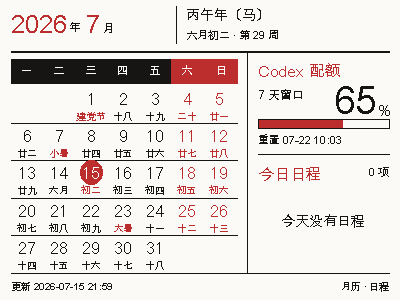
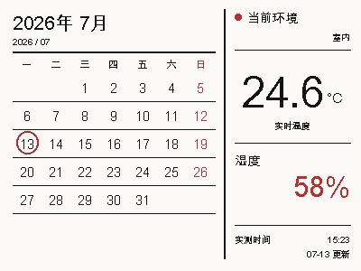

<h1 align="center">EPD AI 配额屏</h1>

<p align="center">把完整月历、今日日程与 Codex 周配额留在桌面上 —— nRF52811 · BLE · 400×300 三色墨水屏</p>

<p align="center">
  <a href="https://askfanxiaojun.github.io/epd-ai-quota-display/">官网</a> ·
  <a href="https://github.com/askfanxiaojun/epd-ai-quota-display">GitHub</a> ·
  <a href="#快速上手">快速上手</a> ·
  <a href="docs/TROUBLESHOOTING.md">故障排查</a>
</p>

<p align="center">
  <a href="https://askfanxiaojun.github.io/epd-ai-quota-display/">
    
  </a>
</p>

一块闲置的 400×300 三色电子价签，可以显示 **完整月历 + Mac 今日日程 + Codex 7 天真实剩余配额**，也可以
切换为 **左侧月历 + 右侧当前温度**。配套定制固件可直接读取 SSD1619 屏幕
控制器温度，并在设备上自行跨日、每小时刷新；需要更准确的温湿度时，也可以让
Mac 从外部传感器读取数据、生成整屏图层后通过 BLE 写入。

本项目面向使用
[`YCD12/EPD-nRF5_DYC`](https://github.com/YCD12/EPD-nRF5_DYC) 固件的
nRF52811 电子价签。设备独立日历温度模式需要刷入本项目配套修改的固件。

> 当前 Codex 订阅接口只展示 7 天窗口，因此新的 `calendar-agenda` 页面不再
> 显示已经取消的 5 小时窗口。旧版纯配额页面仍然保留。

## 功能

| 功能 | 说明 |
| --- | --- |
| **日历 + 日程 + 周配额** | 保留原固件的阴历、节日、节气与休班标记，同时读取 Mac 日历今天的事件，并显示 Codex 7 天剩余量。 |
| **真实 Codex 配额** | 读取 7 天窗口的剩余百分比、进度条和重置时间，不做本地估算。 |
| **设备独立日历温度** | 左侧显示月历，右侧读取 SSD1619 控制器温度；每天更新日期、每小时更新温度，不依赖持续蓝牙连接。 |
| **外部温湿度模式** | 可选用本地实体传感器获得更准确的环境温度；湿度缺失时自动隐藏。 |
| **多种传感器入口** | 支持本地 JSON 文件、HTTP JSON 接口和命令行实测值，不接入天气预报。 |
| **黑白红三色渲染** | 使用 Pillow 生成黑色与红色两个 1-bit 图层，每个图层 15,000 字节。 |
| **BLE 写入电子价签** | 扫描 `NRF_EPD_*`，按协商后的 MTU 分块发送到 nRF52811，再触发 SSD1619 刷新。 |
| **可配置自动更新** | 使用 macOS 原生 `launchd` 后台运行，配额默认 30 分钟，环境页面建议 15 分钟。 |
| **失败时保留上一帧** | 自动更新默认不预先清屏；蓝牙中途断开时保留旧画面，并自动重试一次完整图层。 |
| **无变化不刷新** | 日期、周配额和今日日程均未变化时跳过 BLE 写入，减少闪屏和全刷次数。 |
| **完整中文教程** | 包含安装、BLE 协议、空白屏排查、实际验证记录和最终 HTML 设计稿。 |

## 显示内容

### 完整月历 + 今日日程 + Codex 周配额

<p align="center">
  
</p>

推荐使用新的 `calendar-agenda` 模式：

- 左侧保留原固件月历的信息密度，包括阴历、节日、二十四节气、周末红色和 2026 年“休 / 班”标记；
- 顶部显示干支、生肖、阴历日期和 ISO 周数；
- 右上仅显示 Codex 7 天剩余百分比、进度条和重置时间；
- 右下从 macOS Calendar 只读获取今天的日程，按开始时间排序，最多显示 4 条；
- 当天没有事件时显示“今天没有日程”；日期、配额或日程发生变化才写屏。

运行真实数据预览：

```zsh
.venv/bin/python epd_status.py --mode calendar-agenda --dry-run
```

程序优先只读查询 macOS 的 Calendar 数据库，失败时再回退到 Calendar
自动化接口。它不会创建、修改或删除日程。当前固件不会通过 BLE 返回可靠电量，
因此页面不显示空电池占位，避免占用本就有限的显示空间。

### 设备独立日历温度

刷入配套固件后执行一次：

```zsh
.venv/bin/python epd_status.py --device-calendar-temperature
```

时间和模式同步完成后，Mac 可以断开蓝牙。设备会使用自身 RTC 维护日期，每天
重画“今天”，并每小时通过 SSD1619 的 `TSENSOR_READ` 指令读取控制器温度。
这个读数通常会随室温变化，但它是屏幕控制器芯片温度，不是独立校准的环境传感器，
也无法提供湿度。

### 外部传感器日历 + 环境样式

<p align="center">
  
</p>

`calendar-sensor` 模式包含：

- 左侧完整月历，红圈标出今天，周日使用红色；
- 右侧显示传感器当前实测温度；
- 传感器提供湿度时才显示湿度区域；
- 显示实际测量时间，默认拒绝超过 30 分钟的旧数据；
- 后台任务跨过午夜后，下一次刷新会自动显示新的“今天”。

这里的“实时”表示来自本地传感器的最近一次实际测量，而不是天气服务的
预报或城市观测值。电子墨水屏不适合秒级刷新，建议每 10～30 分钟更新一次。

> 外部传感器组合样式由
> Mac 生成整屏位图，并通过已经验证的 BLE 图像链路发送。Mac 未运行时，墨水屏
> 会继续保留上一帧，但不会自行更新温湿度或跨日日期。

### AI 配额样式

面板包含：

- Codex 5 小时窗口剩余百分比、进度条和重置时间；
- Codex 7 天窗口剩余百分比、进度条和重置时间；
- Claude Code 5 小时与 7 天占位；
- 最后更新时间（日期 + 时间）；
- 黑、红、白三色图层。

最终设计稿也保存在
[`design/Codex Claude Quota Display.html`](design/Codex%20Claude%20Quota%20Display.html)，
方便在浏览器中查看排版方案。实际写屏使用的是 `epd_status.py` 中对应的
Pillow 渲染实现。

屏幕的内容虽然看起来是文字和进度条，但对设备而言仍然是两个 1-bit 位图
图层。Mac 使用 Pillow 先把数据排版成 400×300 像素，再分别发送黑色层和
红色层。

### 高剩余量边界测试

实体屏测试中曾发现 `99%` 与进度条距离过近。当前版本已经调整大数字和进度条
的垂直间距，并使用两个 `99%` 窗口进行压力测试。

<p align="center">
  
</p>

## 工作原理

```text
~/.codex/auth.json
        │
        ▼
ChatGPT Codex usage endpoint
        │
        ▼
epd_status.py 计算剩余比例并绘制 400×300 页面
        │
        ├── black plane: 15,000 bytes
        └── red plane:   15,000 bytes
        │
        ▼
macOS CoreBluetooth / Bleak
        │
        ▼
nRF52811 + EPD-nRF5_DYC firmware
        │
        ▼
SSD1619 black/white/red EPD
```

配额获取方式参考
[`farion1231/cc-switch`](https://github.com/farion1231/cc-switch)：读取 Codex
在本机保存的 ChatGPT OAuth 会话，然后直接请求 Codex usage endpoint。
访问令牌只作为 HTTPS 请求头使用，不会输出到日志、图片或项目文件。

## 硬件与软件要求

### 硬件

- Apple Silicon 或 Intel Mac，支持蓝牙；
- 刷入 EPD-nRF5_DYC 固件的 nRF52811 电子价签；
- 400×300、SSD1619、黑白红三色墨水屏；
- 设备广播名称以 `NRF_EPD` 开头。

本项目已经验证过的设备配置通知为：

```text
MOSI=14 SCLK=13 CS=06 DC=05 RST=04 BUSY=03
BS=02 model=02 LED=12 EN=07
```

不同屏幕、驱动芯片或引脚配置可能需要修改原固件，而不只是修改本项目。

### 软件

- macOS；
- Python 3.10 或更高版本；
- 已登录的 Codex ChatGPT 账号；
- Python 包：`bleak`、`Pillow`。

## 快速上手

开始之前需要：一台支持蓝牙的 Mac、一块已经刷入 EPD-nRF5_DYC 固件的
nRF52811 电子价签，以及本机已经登录的 Codex ChatGPT 账号。

### 第 1 步 · 安装环境

将仓库放到任意固定目录，然后进入项目：

```zsh
cd /path/to/epd-ai-quota-display
python3 -m venv .venv
.venv/bin/pip install -r requirements.txt
```

确认本机存在 Codex 登录文件：

```zsh
test -f ~/.codex/auth.json && echo "Codex login found"
```

程序不会打印其中的 token。如果 Codex 使用 API key 模式而不是 ChatGPT
登录模式，则无法通过这里的 endpoint 获取订阅配额。

设备独立日历温度模式不需要登录 Codex，也不需要外部传感器。若需要准确的环境
温度或湿度，则仍然需要实体传感器；SSD1619 只能提供控制器温度，不能测湿度。

### 第 2 步 · 先生成预览

```zsh
.venv/bin/python epd_status.py --dry-run
```

成功后会显示类似：

```text
Fetched Codex usage windows: 5 HOURS 42% left, 7 DAYS 81% left
Rendered /path/to/test-card.png (15000 bytes x 2 layers)
```

预览文件保存在项目根目录的 `test-card.png`。这一步会访问网络，但不会连接
蓝牙，也不会改变屏幕内容。

生成完整月历、真实 Codex 7 天配额和今天 Mac 日程的推荐页面：

```zsh
.venv/bin/python epd_status.py --mode calendar-agenda --dry-run
```

第一次读取日历时，macOS 可能要求授权。也可以复制 `config.example.json` 为
`config.json`，让后台任务默认使用这个页面。

生成日历环境样式演示预览，不连接传感器或蓝牙：

```zsh
.venv/bin/python epd_status.py --mode calendar-sensor --demo-sensor --dry-run
```

### 配置真实温湿度传感器

复制配置模板：

```zsh
cp config.example.json config.json
```

`config.json` 已被 `.gitignore` 忽略。默认示例从项目目录的
`sensor-reading.json` 读取：

```json
{
  "temperature": 24.6,
  "humidity": 58,
  "timestamp": "2026-07-13T14:30:00+08:00"
}
```

负责读取实体传感器的程序只需要持续覆盖这个文件即可。`humidity` 可以完全省略；
页面会自动移除湿度模块。如果设备已经通过 Home Assistant、ESPHome、Homebridge
或其他网关提供 HTTP JSON，也可以把配置改成：

```json
{
  "display_mode": "calendar-sensor",
  "sensor": {
    "url": "http://127.0.0.1:8123/local/room-sensor.json",
    "temperature_key": "temperature",
    "humidity_key": "humidity",
    "timestamp_key": "updated_at",
    "location": "书房",
    "max_age_minutes": 30
  }
}
```

接口字段嵌套时可以使用点号，例如 `state.temperature`。需要 Bearer Token 时，
可以在未提交的 `config.json` 中增加 `"token"`，或手动运行时设置
`EPD_SENSOR_TOKEN`。

先用真实数据生成预览：

```zsh
.venv/bin/python epd_status.py --mode calendar-sensor --dry-run
```

### 第 3 步 · 验证屏幕和固件

读取当前固件版本：

```zsh
.venv/bin/python epd_status.py --device-info
```

设备独立日历温度模式要求版本 `0x21` 或更高。启用它：

```zsh
.venv/bin/python epd_status.py --device-calendar-temperature
```

如果还没有验证硬件，先调用固件内置日历：

```zsh
.venv/bin/python epd_status.py --calendar-test
```

日历能显示，说明以下链路基本正常：

- Mac 能扫描并连接设备；
- 固件的屏幕型号和引脚配置可用；
- EPD 初始化与刷新正常。

如果日历可以显示而自定义图片空白，重点查看
[排错指南](docs/TROUBLESHOOTING.md) 中的清屏后重新初始化问题。

### 第 4 步 · 写入真实 Codex 数据

确保设备正在广播，且没有被网页或其他 BLE 客户端占用：

```zsh
.venv/bin/python epd_status.py
```

一次完整成功的结尾应当是：

```text
Sent black 62/62 chunks
Sent red 62/62 chunks
Requesting screen refresh …
Refresh command sent. The panel may take several seconds to settle.
```

墨水屏刷新需要几秒钟。完整流程会先清除旧画面，再重新初始化 EPD，发送
黑色层和红色层，最后触发刷新。

可用参数：

| 参数 | 用途 |
| --- | --- |
| `--dry-run` | 只获取数据并生成预览，不使用蓝牙 |
| `--calendar-test` | 让固件显示内置日历，用于硬件诊断 |
| `--device-info` | 读取设备当前固件版本 |
| `--device-calendar-temperature` | 启用设备独立的日历 + SSD1619 温度模式 |
| `--fixed-test` | 发送固定测试卡，不获取 Codex 配额 |
| `--clear-first` | 人工维护时先执行物理清屏；自动更新默认不使用 |
| `--name-prefix PREFIX` | 修改要扫描的 BLE 名称前缀 |
| `--mode calendar-agenda` | 显示完整月历、Codex 7 天配额和 Mac 今日日程 |
| `--mode calendar-sensor` | 显示左侧日历、右侧实时环境的新样式 |
| `--calendar-name NAME` | 只显示指定 Mac 日历，可重复使用 |
| `--agenda-limit N` | 最多显示多少条今日日程，默认 4 条 |
| `--sensor-file PATH` | 从 JSON 文件读取实测温湿度 |
| `--sensor-url URL` | 从 HTTP JSON 接口读取实测温湿度 |
| `--temperature N` | 单次测试时直接传入摄氏温度 |
| `--humidity N` | 可选的单次相对湿度 |
| `--max-sensor-age N` | 允许的数据最大年龄，单位分钟；`0` 表示关闭检查 |

### 第 5 步 · 设置每 30 分钟自动更新

macOS 使用 `launchd` 管理后台任务。项目提供了安装脚本，会：

1. 创建或复用 `.venv`；
2. 安装依赖；
3. 根据当前项目路径生成用户级 LaunchAgent；
4. 注册任务；
5. 注册后立即运行一次，此后每 1800 秒运行一次。

每次运行仍会获取最新数据，但脚本会先和上一次成功写入的板面状态比较。只有
屏幕上可见的日期、Codex 7 天百分比、重置时间或今日日程发生变化时，
才会连接蓝牙并刷新墨水屏。
底部的 `UPDATED` 时间不参与比较，因此不会仅仅因为时间变化而触发刷新。

自动任务默认直接覆盖完整黑色和红色图层，不会在传输前把实体屏幕清成白色；
如果 BLE 在传输中断开，脚本会重新扫描并重试一次。只有两层数据和刷新命令
全部成功后，才会保存新的显示状态。需要排查残影时可以人工使用
`--clear-first --force`，但不建议在无人值守任务中启用预清屏。

上一次成功写入的状态保存在项目目录下的 `.last-display-state.json`。只有蓝牙
写入和刷新全部成功后才会更新这个文件；写入失败不会覆盖上一次状态。

执行：

```zsh
chmod +x scripts/*.sh
./scripts/install-launchagent.sh
```

日历环境模式建议每 15 分钟刷新一次：

```zsh
EPD_UPDATE_INTERVAL_SECONDS=900 ./scripts/install-launchagent.sh
```

不需要一直打开 Terminal。任务注册在：

```text
~/Library/LaunchAgents/com.local.epd-ai-quota-display.plist
```

查看运行状态：

```zsh
launchctl print gui/$(id -u)/com.local.epd-ai-quota-display
```

立即手动触发一次：

```zsh
./scripts/update-now.sh
```

如果数据没有变化，这个命令也会正常跳过刷新。需要忽略状态比较、强制重新写屏时：

```zsh
.venv/bin/python epd_status.py --force
```

查看日志：

```zsh
tail -n 100 logs/update.log
tail -n 100 logs/error.log
```

卸载定时任务：

```zsh
./scripts/uninstall-launchagent.sh
```

卸载脚本只注销 LaunchAgent 并删除安装到 `~/Library/LaunchAgents` 的 plist，
不会删除项目、虚拟环境或日志。

### 修改更新间隔

模板文件位于：

```text
launchd/com.example.epd-ai-quota-display.plist.template
```

默认安装间隔是 1800 秒，也可以在安装时通过
`EPD_UPDATE_INTERVAL_SECONDS` 修改。模板中的实际值会在安装时填入：

```xml
<key>StartInterval</key>
<integer>__UPDATE_INTERVAL__</integer>
```

单位为秒。例如一小时是 `3600`。修改模板后重新运行安装脚本。

30 分钟是比较平衡的默认值：Codex 配额不需要分钟级刷新，同时可以减少
墨水屏全刷次数和无意义的 BLE 连接。

## 定时运行的限制

- Mac 必须开机、用户已登录且处于唤醒状态；
- 该任务不会单独唤醒正在睡眠的 Mac；
- 墨水屏必须在蓝牙范围内并处于可广播状态；
- Codex OAuth 登录过期后，需要先重新登录 Codex；
- 如果某次网络请求或蓝牙扫描失败，日志会记录错误，屏幕会保留上一次画面；
- 当前是全屏刷新，不适合非常高频地运行。

## 为什么不是 macOS App

当前链路只有一个数据源和一块屏幕，Python + LaunchAgent 已经能够做到：

- 登录后启动；
- 无终端后台运行；
- 固定间隔更新；
- 保存日志；
- 手动触发刷新。

如果以后需要菜单栏状态、图形化设置、多设备管理或错误通知，可以再把同一
套数据和 BLE 逻辑封装为 Swift 菜单栏 App。现阶段脚本方案更透明，也更方便
排错。

## 添加 Claude Code 数据

渲染器已经为 Claude Code 预留了与 Codex 相同层级的两个窗口。后续接入时，
建议让数据获取函数输出统一结构：

```python
{
    "label": "5 HOURS",
    "used": 35.0,
    "reset_at": 1783812345,
}
```

`used` 表示已用百分比，界面会显示 `100 - used` 的剩余量。接入数据源时应
避免把账号 token 写入日志或仓库。

## 项目结构

```text
epd-ai-quota-display/
├── README.md
├── epd_status.py
├── calendar_data.py
├── secure_dfu_ble.py
├── requirements.txt
├── design/
│   ├── Codex Claude Quota Display.html
│   └── Codex Calendar Agenda Display.html
├── launchd/
│   └── com.example.epd-ai-quota-display.plist.template
├── scripts/
│   ├── install-launchagent.sh
│   ├── uninstall-launchagent.sh
│   └── update-now.sh
└── docs/
    ├── BLE_PROTOCOL.md
    ├── DEVELOPMENT_HISTORY.md
    ├── TROUBLESHOOTING.md
    ├── VERIFICATION.md
    └── assets/
        ├── calendar-agenda-preview.png
        ├── quota-display-preview.png
        └── quota-display-99-percent-test.png
```

## 深入资料

- [BLE 与图像传输协议](docs/BLE_PROTOCOL.md)
- [常见问题与排错](docs/TROUBLESHOOTING.md)
- [从可行性验证到定时更新的完整开发记录](docs/DEVELOPMENT_HISTORY.md)
- [实际验证记录](docs/VERIFICATION.md)
- [EPD-nRF5_DYC 原始固件](https://github.com/YCD12/EPD-nRF5_DYC)
- [cc-switch](https://github.com/farion1231/cc-switch)

## 安全说明

- 不要提交 `~/.codex/auth.json`；
- 不要在 Issue 或日志中粘贴 OAuth token；
- 本项目不会复制或持久化 token；
- `.gitignore` 已排除虚拟环境、日志、缓存和本机生成的 `test-card.png`；
- 发布前请再次运行 `git status`，确认没有本机凭据或日志被加入版本控制。
